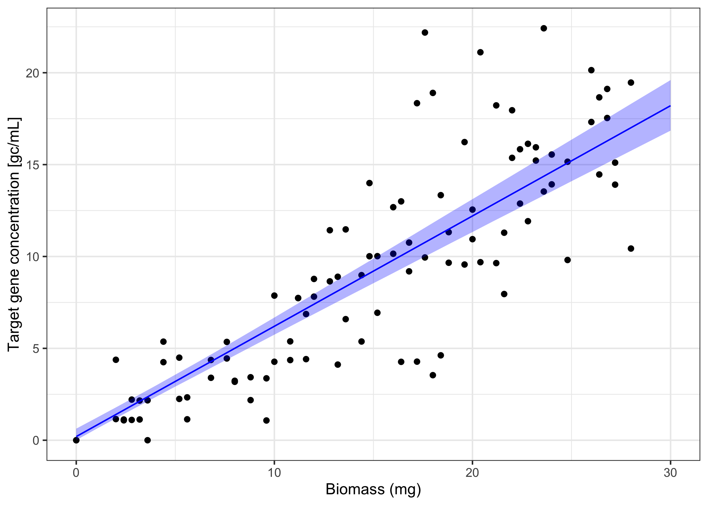

# dPCRfit: Fit regression models to digital PCR data

<!-- badges: start -->

[](https://www.tidyverse.org/lifecycle/#experimental)
[](https://github.com/adrian-lison/dPCRfit/blob/main/LICENSE.md/)
[](https://zenodo.org/badge/latestdoi/947279049)
<!-- badges: end -->

## About

The `dPCRfit` R package allows fitting regression models to gene
concentration measurements obtained via digital PCR (dPCR). It uses a
dPCR-specific likelihood that accounts for non-detects and
concentration-dependent measurement error (see
[here](https://doi.org/10.1101/2024.10.14.618307)). You can specify
regression models via a simple formula like in the base R `lm` function.

This package is useful for directly fitting regression models to dPCR
concentration measurements, for example when partition counts are not
available.

Information about laboratory parameters (e.g. partition volume or sample
dilution) can be provided as priors. The package currently supports
fixed-effect linear models (identity or log link). Models are fitted
using `stan` through the `cmdstanr` interface.

## Installing the package

Install the development version of `dPCRfit` from GitHub:

``` r
remotes::install_github("adrian-lison/dPCRfit", dependencies = TRUE)
```

⚠️ Note that `dPCRfit` also requires CmdStan to be installed on your
system.
<details>
<summary>
Click here for details on installing stan.
</summary>

Simply run the `install_cmdstan()` function from `cmdstanr`. If you
experience any problems installing CmdStan, see the [cmdstanr
vignette](https://mc-stan.org/cmdstanr/articles/cmdstanr.html) for help.

``` r
cmdstanr::check_cmdstan_toolchain()
cmdstanr::install_cmdstan(cores = 2) # use more cores to speed up
```

The stan model used by dPCRfit needs to be compiled for your device.
This is only necessary once - after installing or updating the package -
and can be done using the `dPCRfit_compile()` function.

``` r
dPCRfit::dPCRfit_compile()
```

If the models are not successfully compiled, please ensure that
`cmdstan` is properly set up and try updating it to a newer version
using `cmdstanr::install_cmdstan()`. If the problem persists, please run
`dPCRfit::dPCRfit_compile(verbose = TRUE)` and post the output in a new
issue on GitHub, along with your `cmdstanr::cmdstan_version()`.
</details>

## Introduction

This short intro demonstrates how to fit a linear regression model to
dPCR data using the `dPCRfit` package.

``` r
library(dPCRfit) # load the dPCRfit package
library(ggplot2) # load ggplot2 for plotting
```

### Load example data

We load an example dataset with simulated dPCR measurements. The dataset
represents hypothetical measurements of a target gene concentration from
samples with different biomass.

``` r
dPCR_data <- dPCR_linear_simulated
```

We can plot the simulated linear relationship between biomass and target
gene concentration using ggplot:

``` r
ggplot(dPCR_data, aes(x=biomass, y=concentration)) +
  geom_point() +
  xlab("Biomass (mg)") + ylab("Target gene concentration [gc/mL]") +
  theme_bw()
```


## Fit a linear model

We will now use `dPCRfit` to fit a linear regression model to the
simulated concentration measurements. For this, we must first define a
model of the measurement noise. In our simulated data, we assumed a dPCR
assay with the following parameters:

- total number of partitions: 25’000
- concentration conversion factor (gc per partition for one
  concentration unit in original sample): 1.73e-5
- pre-PCR coefficient of variation: 10%

The helper function `noise_dPCR()` allows us to specify such a dPCR
assay with suitable parameters:

``` r
noise_model <- noise_dPCR(
          total_partitions_prior_mu = 25000, # there are 25000 partitions
          total_partitions_prior_sigma = 0, # fix the number of partitions
          volume_scaled_prior_mu = 1.73e-5, # the conversion factor
          volume_scaled_prior_sigma = 0, # fix the conversion factor
          prePCR_noise_type = "lognormal" # we assume that pre-PCR noise is log-normally distributed
        )
```

Note that in this example, by setting the standard deviation (sigma) of
the priors to 0, we fix the parameters to their true values. In
practice, the exact number of partitions or the conversion factor may be
uncertain, which you can express by providing a prior with positive
standard deviation. The parameter value will then be estimated jointly
from the data.

Once we have a suitable noise model, we can run a linear regression
using `dPCRfit`:

``` r
fitted_model <- dPCRfit(
        formula = concentration ~ biomass, # linear regression formula
        data = dPCR_data, # our data
        prior_intercept = c(0,1), # standard normal prior for the intercept
        prior_coefficients = c(0,1), # standard normal prior for the regression coefficient
        measurements = concentration_measurements(
          id_col = "sample_id", # name of the column with the sample id
          replicate_col = "replicate_id", # name of the column with the biological replicate id
          concentration_col = "concentration", # name of the column with the concentration measurements
        ),
        noise = noise_model # the dPCR noise model we defined above
      )
#> Running MCMC with 4 parallel chains...
#> 
#> Chain 1 Iteration:    1 / 2000 [  0%]  (Warmup) 
#> Chain 2 Iteration:    1 / 2000 [  0%]  (Warmup) 
#> Chain 3 Iteration:    1 / 2000 [  0%]  (Warmup) 
#> Chain 4 Iteration:    1 / 2000 [  0%]  (Warmup) 
#> Chain 4 Iteration:  200 / 2000 [ 10%]  (Warmup) 
#> Chain 4 Iteration:  400 / 2000 [ 20%]  (Warmup) 
#> Chain 4 Iteration:  600 / 2000 [ 30%]  (Warmup) 
#> Chain 3 Iteration:  200 / 2000 [ 10%]  (Warmup) 
#> Chain 4 Iteration:  800 / 2000 [ 40%]  (Warmup) 
#> Chain 3 Iteration:  400 / 2000 [ 20%]  (Warmup) 
#> Chain 4 Iteration: 1000 / 2000 [ 50%]  (Warmup) 
#> Chain 4 Iteration: 1001 / 2000 [ 50%]  (Sampling) 
#> Chain 3 Iteration:  600 / 2000 [ 30%]  (Warmup) 
#> Chain 3 Iteration:  800 / 2000 [ 40%]  (Warmup) 
#> Chain 1 Iteration:  200 / 2000 [ 10%]  (Warmup) 
#> Chain 4 Iteration: 1200 / 2000 [ 60%]  (Sampling) 
#> Chain 3 Iteration: 1000 / 2000 [ 50%]  (Warmup) 
#> Chain 3 Iteration: 1001 / 2000 [ 50%]  (Sampling) 
#> Chain 1 Iteration:  400 / 2000 [ 20%]  (Warmup) 
#> Chain 2 Iteration:  200 / 2000 [ 10%]  (Warmup) 
#> Chain 3 Iteration: 1200 / 2000 [ 60%]  (Sampling) 
#> Chain 4 Iteration: 1400 / 2000 [ 70%]  (Sampling) 
#> Chain 1 Iteration:  600 / 2000 [ 30%]  (Warmup) 
#> Chain 2 Iteration:  400 / 2000 [ 20%]  (Warmup) 
#> Chain 3 Iteration: 1400 / 2000 [ 70%]  (Sampling) 
#> Chain 1 Iteration:  800 / 2000 [ 40%]  (Warmup) 
#> Chain 2 Iteration:  600 / 2000 [ 30%]  (Warmup) 
#> Chain 3 Iteration: 1600 / 2000 [ 80%]  (Sampling) 
#> Chain 4 Iteration: 1600 / 2000 [ 80%]  (Sampling) 
#> Chain 1 Iteration: 1000 / 2000 [ 50%]  (Warmup) 
#> Chain 1 Iteration: 1001 / 2000 [ 50%]  (Sampling) 
#> Chain 2 Iteration:  800 / 2000 [ 40%]  (Warmup) 
#> Chain 3 Iteration: 1800 / 2000 [ 90%]  (Sampling) 
#> Chain 1 Iteration: 1200 / 2000 [ 60%]  (Sampling) 
#> Chain 2 Iteration: 1000 / 2000 [ 50%]  (Warmup) 
#> Chain 2 Iteration: 1001 / 2000 [ 50%]  (Sampling) 
#> Chain 3 Iteration: 2000 / 2000 [100%]  (Sampling) 
#> Chain 3 finished in 15.5 seconds.
#> Chain 4 Iteration: 1800 / 2000 [ 90%]  (Sampling) 
#> Chain 1 Iteration: 1400 / 2000 [ 70%]  (Sampling) 
#> Chain 1 Iteration: 1600 / 2000 [ 80%]  (Sampling) 
#> Chain 2 Iteration: 1200 / 2000 [ 60%]  (Sampling) 
#> Chain 4 Iteration: 2000 / 2000 [100%]  (Sampling) 
#> Chain 4 finished in 16.7 seconds.
#> Chain 1 Iteration: 1800 / 2000 [ 90%]  (Sampling) 
#> Chain 2 Iteration: 1400 / 2000 [ 70%]  (Sampling) 
#> Chain 1 Iteration: 2000 / 2000 [100%]  (Sampling) 
#> Chain 1 finished in 17.6 seconds.
#> Chain 2 Iteration: 1600 / 2000 [ 80%]  (Sampling) 
#> Chain 2 Iteration: 1800 / 2000 [ 90%]  (Sampling) 
#> Chain 2 Iteration: 2000 / 2000 [100%]  (Sampling) 
#> Chain 2 finished in 20.1 seconds.
#> 
#> All 4 chains finished successfully.
#> Mean chain execution time: 17.5 seconds.
#> Total execution time: 20.4 seconds.
```

## Results

We can inspect our fitted model using the `summary()` function.

``` r
summary(fitted_model)
#> Call:
#> dPCRfit(formula = concentration ~ biomass, link = identity)
#> 
#> Number of observations: 100 
#> 
#> Coefficients:
#> variable     mean    median  sd       mad      q5      q95     rhat   ess_bulk  ess_tail
#> (Intercept)  0.7032  0.6587  0.40681  0.42038  0.1247  1.4378  1.001  2779      1702    
#> biomass      0.5938  0.5952  0.04251  0.04205  0.5213  0.6632  1.001  4229      3191    
#> 
#> Fitted via MCMC using 4 chains with each:
#> 1000 warm-up iterations
#> 1000 sampling iterations
#> 
#> Diagnostics:
#> No problems detected.
```

Let’s plot the fitted model against the data.

``` r
model_prediction <- predict(
  fitted_model,
  newdata = data.frame(biomass = seq(0,30)),
  interval = "confidence",
  keep_data = TRUE
  )

ggplot(dPCR_data, aes(x=biomass)) +
  geom_point(aes(y=concentration)) +
  geom_line(data = model_prediction, aes(x = biomass, y = mean), color = "blue") +
  geom_ribbon(data = model_prediction, aes(x = biomass, ymin = q5, ymax = q95), fill = "blue", alpha = 0.3) +
  xlab("Biomass (mg)") + ylab("Target gene concentration [gc/mL]") +
  theme_bw()
```



We can also print the fitted coefficients with 95% credible intervals.
The dashed line shows the simulated ground truth.

``` r
ggplot(fitted_model$coef_summary) +
  geom_vline(xintercept = 0, linetype = "dashed") +
  geom_point(aes(y = variable, x = median)) +
  geom_errorbar(aes(y = variable, xmin = q5, xmax = q95), width = 0.2) +
  geom_vline(data = data.frame(variable = c("(Intercept)", "biomass"), true = c(0.2, 0.6)), aes(xintercept = true), linetype = "dotted", color = "darkred") +
  ylab("Coefficient") + xlab("Estimate") + facet_wrap(~variable, scales = "free", ncol = 1) +
  scale_x_continuous(expand = c(0.2, 0.2)) +
  theme_bw()
```

 We see
that the intercept was estimated with large uncertainty, due to the
increased noise at low concentrations. In contrast, the slope of the
linear relationship with biomass was estimated quite precisely.

## Citing the package

If you are using `dPCRfit` in a publication, please cite:

    @article{lisonImprovingInferenceEnvironmental2025,
      title = {Improving inference in environmental surveillance by modeling the statistical features of digital {{PCR}}},
      author = {Lison, Adrian and Julian, Timothy and Stadler, Tanja},
      year = {2025},
      journal = {bioRxiv preprint},
      doi = {10.1101/2024.10.14.618307}
    }
