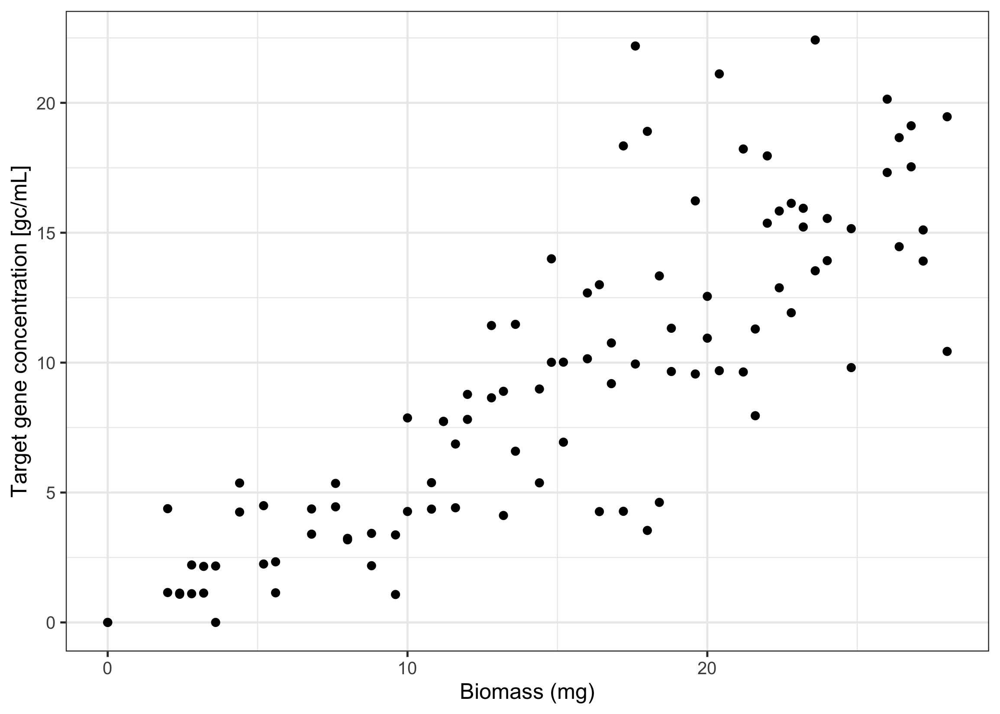
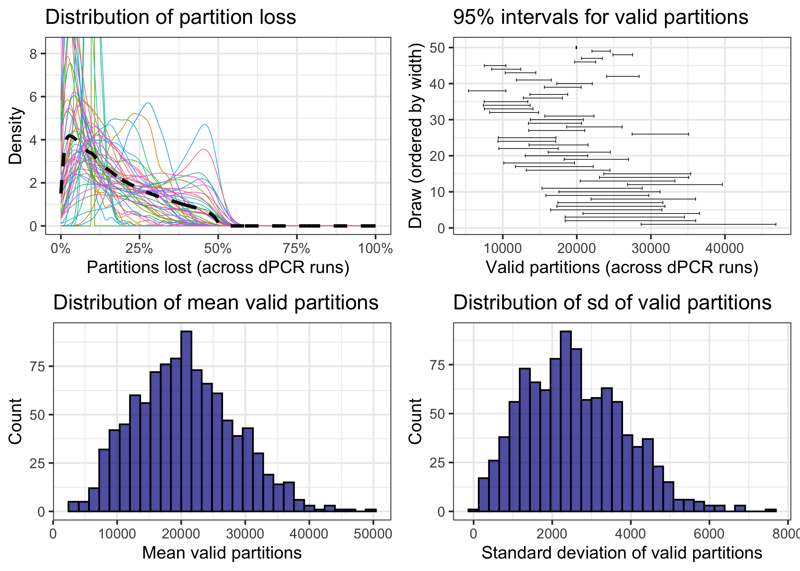

# dPCRfit: Fit regression models to digital PCR data

<!-- badges: start -->

[](https://www.tidyverse.org/lifecycle/#experimental)
[](https://github.com/adrian-lison/dPCRfit/blob/main/LICENSE.md/)
[](https://zenodo.org/badge/latestdoi/947279049)
<!-- badges: end -->

## About

The `dPCRfit` R package allows fitting regression models to gene
concentration measurements obtained via digital PCR (dPCR). It uses a
dPCR-specific likelihood that accounts for non-detects and
concentration-dependent measurement error (see
[here](https://doi.org/10.1101/2024.10.14.618307)). You can specify
regression models via a simple formula like in the base R `lm` function.

This package is useful for directly fitting regression models to dPCR
concentration measurements, for example when partition counts are not
available.

Information about laboratory parameters (e.g. partition volume or sample
dilution) can be provided as priors. The package currently supports
fixed-effect linear models (identity or log link). Models are fitted
using `stan` through the `cmdstanr` interface, supporting exact
estimates via MCMC sampling, or fast approximation via pathfinder
variational inference.

## Installing the package

Install the development version of `dPCRfit` from GitHub:

``` r
remotes::install_github("adrian-lison/dPCRfit", dependencies = TRUE)
```

⚠️ Note that `dPCRfit` also requires CmdStan to be installed on your
system.
<details>
<summary>
Click here for details on installing stan.
</summary>

Simply run the `install_cmdstan()` function from `cmdstanr`. If you
experience any problems installing CmdStan, see the [cmdstanr
vignette](https://mc-stan.org/cmdstanr/articles/cmdstanr.html) for help.

``` r
cmdstanr::check_cmdstan_toolchain()
cmdstanr::install_cmdstan(cores = 2) # use more cores to speed up
```

The stan model used by dPCRfit needs to be compiled for your device.
This is only necessary once - after installing or updating the package -
and can be done using the `dPCRfit_compile()` function.

``` r
dPCRfit::dPCRfit_compile()
```

If the models are not successfully compiled, please ensure that
`cmdstan` is properly set up and try updating it to a newer version
using `cmdstanr::install_cmdstan()`. If the problem persists, please run
`dPCRfit::dPCRfit_compile(verbose = TRUE)` and post the output in a new
issue on GitHub, along with your `cmdstanr::cmdstan_version()`.
</details>

## Introduction

This short intro demonstrates how to fit a linear regression model to
dPCR data using the `dPCRfit` package.

``` r
library(dPCRfit) # load the dPCRfit package
library(ggplot2) # load ggplot2 for plotting
```

### Load example data

We load an example dataset with simulated dPCR measurements. The dataset
represents hypothetical measurements of a target gene concentration from
samples with different biomass.

``` r
dPCR_data <- dPCR_linear_simulated
```

We can plot the simulated linear relationship between biomass and target
gene concentration using ggplot:

``` r
ggplot(dPCR_data, aes(x=biomass, y=concentration)) +
  geom_point() +
  xlab("Biomass (mg)") + ylab("Target gene concentration [gc/mL]") +
  theme_bw()
```



## Fit a linear model

We will now use `dPCRfit` to fit a linear regression model to the
simulated concentration measurements. For this, we must first define a
model of the measurement noise. In our simulated data, we assumed a dPCR
assay with the following parameters:

- maximum number of partitions: 30’000
- partition loss (invalid partitions): average: 12%, stdev: 5% points,
  max: 50%
- concentration conversion factor : 1.73e-5 (gc/partition for 1
  concentration unit in original sample)
- pre-PCR coefficient of variation: 10%

In our model, we will assume that we don’t know the details of the dPCR
assay. We therefore specify uncertain priors for the assay
characteristics using the helper function `noise_dPCR()`:

``` r
noise_model <- noise_dPCR(
          max_partitions_prior_lower = 10000, # partition number of chip between 10'000 and 40'000
          max_partitions_prior_upper = 40000,
          partition_loss_mean_prior_lower = 0.05, # expected share of invalid partitions between 5% and 30%
          partition_loss_mean_prior_upper = 0.3,
          partition_loss_variation_prior_lower = 0.5, # broad prior on variation of share of invalid partitions
          partition_loss_variation_prior_upper = 2,
          partition_loss_max = 0.5, # maximum share of invalid partitions is 50%
          volume_scaled_prior_mu = 1e-5, # broad prior for the concentration conversion factor
          volume_scaled_prior_sigma = 4e-5,
          prePCR_noise_type = "lognormal", # we assume that pre-PCR noise is log-normally distributed
        )
```

To summarize, we have made the following assumptions:

- we don’t know what chip was used, but expect it to have between 10’000
  and 40’000 partitions
- the average share of invalid partitions per dPCR run could be
  somewhere between 5% and 30%
- we don’t know how much the share of invalid partitions varies between
  dPCR runs, so we use a broad prior for it
- we assume that PCR runs with more than 50% invalid partitions are
  discarded during quality control
- we think that the conversion factor is on the order of magnitude of
  1e-5 but we use a broad prior for it

Note that we can also visualize the resulting prior distribution for the
number of partitions:

``` r
plot_prior(noise_model, "partitions")
```



Using these priors, the true values of these parameters will be
estimated jointly from the data.

Once we have a suitable noise model, we can run a linear regression
using `dPCRfit`:

``` r
fitted_model <- dPCRfit(
        formula = concentration ~ biomass, # linear regression formula
        data = dPCR_data, # our data
        prior_intercept = c(0,1), # standard normal prior for the intercept
        prior_coefficients = c(0,1), # standard normal prior for the regression coefficients
        measurements = concentration_measurements(
          id_col = "sample_id", # name of the column with the sample id
          replicate_col = "bio_replicate_id", # name of the column with the biological replicate id
          concentration_col = "concentration", # name of the column with the concentration measurements
          n_averaged_col = "n_technical_reps" # name of the column with the number of technical replicates per biological replicate
        ),
        noise = noise_model, # the dPCR noise model we defined above
        nondetect = nondetect_dPCR() # also model non-detects from dPCR
      )
#> Initializing chains via pathfinder...
#> Running MCMC with 4 parallel chains...
#> 
#> Chain 1 Iteration:    1 / 2000 [  0%]  (Warmup) 
#> Chain 2 Iteration:    1 / 2000 [  0%]  (Warmup) 
#> Chain 3 Iteration:    1 / 2000 [  0%]  (Warmup) 
#> Chain 4 Iteration:    1 / 2000 [  0%]  (Warmup) 
#> Chain 3 Iteration:  200 / 2000 [ 10%]  (Warmup) 
#> Chain 2 Iteration:  200 / 2000 [ 10%]  (Warmup) 
#> Chain 4 Iteration:  200 / 2000 [ 10%]  (Warmup) 
#> Chain 3 Iteration:  400 / 2000 [ 20%]  (Warmup) 
#> Chain 1 Iteration:  200 / 2000 [ 10%]  (Warmup) 
#> Chain 2 Iteration:  400 / 2000 [ 20%]  (Warmup) 
#> Chain 1 Iteration:  400 / 2000 [ 20%]  (Warmup) 
#> Chain 3 Iteration:  600 / 2000 [ 30%]  (Warmup) 
#> Chain 4 Iteration:  400 / 2000 [ 20%]  (Warmup) 
#> Chain 2 Iteration:  600 / 2000 [ 30%]  (Warmup) 
#> Chain 1 Iteration:  600 / 2000 [ 30%]  (Warmup) 
#> Chain 3 Iteration:  800 / 2000 [ 40%]  (Warmup) 
#> Chain 1 Iteration:  800 / 2000 [ 40%]  (Warmup) 
#> Chain 2 Iteration:  800 / 2000 [ 40%]  (Warmup) 
#> Chain 4 Iteration:  600 / 2000 [ 30%]  (Warmup) 
#> Chain 4 Iteration:  800 / 2000 [ 40%]  (Warmup) 
#> Chain 3 Iteration: 1000 / 2000 [ 50%]  (Warmup) 
#> Chain 3 Iteration: 1001 / 2000 [ 50%]  (Sampling) 
#> Chain 1 Iteration: 1000 / 2000 [ 50%]  (Warmup) 
#> Chain 1 Iteration: 1001 / 2000 [ 50%]  (Sampling) 
#> Chain 2 Iteration: 1000 / 2000 [ 50%]  (Warmup) 
#> Chain 2 Iteration: 1001 / 2000 [ 50%]  (Sampling) 
#> Chain 3 Iteration: 1200 / 2000 [ 60%]  (Sampling) 
#> Chain 4 Iteration: 1000 / 2000 [ 50%]  (Warmup) 
#> Chain 4 Iteration: 1001 / 2000 [ 50%]  (Sampling) 
#> Chain 1 Iteration: 1200 / 2000 [ 60%]  (Sampling) 
#> Chain 3 Iteration: 1400 / 2000 [ 70%]  (Sampling) 
#> Chain 4 Iteration: 1200 / 2000 [ 60%]  (Sampling) 
#> Chain 1 Iteration: 1400 / 2000 [ 70%]  (Sampling) 
#> Chain 2 Iteration: 1200 / 2000 [ 60%]  (Sampling) 
#> Chain 3 Iteration: 1600 / 2000 [ 80%]  (Sampling) 
#> Chain 4 Iteration: 1400 / 2000 [ 70%]  (Sampling) 
#> Chain 1 Iteration: 1600 / 2000 [ 80%]  (Sampling) 
#> Chain 3 Iteration: 1800 / 2000 [ 90%]  (Sampling) 
#> Chain 4 Iteration: 1600 / 2000 [ 80%]  (Sampling) 
#> Chain 1 Iteration: 1800 / 2000 [ 90%]  (Sampling) 
#> Chain 2 Iteration: 1400 / 2000 [ 70%]  (Sampling) 
#> Chain 3 Iteration: 2000 / 2000 [100%]  (Sampling) 
#> Chain 3 finished in 32.5 seconds.
#> Chain 4 Iteration: 1800 / 2000 [ 90%]  (Sampling) 
#> Chain 1 Iteration: 2000 / 2000 [100%]  (Sampling) 
#> Chain 1 finished in 33.1 seconds.
#> Chain 4 Iteration: 2000 / 2000 [100%]  (Sampling) 
#> Chain 4 finished in 34.2 seconds.
#> Chain 2 Iteration: 1600 / 2000 [ 80%]  (Sampling) 
#> Chain 2 Iteration: 1800 / 2000 [ 90%]  (Sampling) 
#> Chain 2 Iteration: 2000 / 2000 [100%]  (Sampling) 
#> Chain 2 finished in 40.0 seconds.
#> 
#> All 4 chains finished successfully.
#> Mean chain execution time: 35.0 seconds.
#> Total execution time: 40.5 seconds.
```

## Results

We can inspect our fitted model using the `summary()` function.

``` r
summary(fitted_model)
#> Call:
#> dPCRfit(formula = concentration ~ biomass, link = identity)
#> 
#> Number of observations: 100 
#> 
#> Coefficients:
#> variable     mean    median  sd       mad     q5      q95     rhat    ess_bulk  ess_tail
#> (Intercept)  0.1989  0.1545  0.17121  0.1475  0.0132  0.5412  0.9996  3127      1929    
#> biomass      0.6003  0.6006  0.02537  0.0249  0.5589  0.6416  1.0009  6383      3046    
#> 
#> Fitted via MCMC using 4 chains with each:
#> 1000 warm-up iterations
#> 1000 sampling iterations
#> 
#> Diagnostics:
#> No problems detected.
```

Let’s plot the fitted model against the data.

``` r
model_prediction <- predict(
  fitted_model,
  newdata = data.frame(biomass = seq(0,30)),
  interval = "confidence",
  keep_data = TRUE
  )

ggplot(dPCR_data, aes(x=biomass)) +
  geom_point(aes(y=concentration)) +
  geom_line(data = model_prediction, aes(x = biomass, y = mean), color = "blue") +
  geom_ribbon(data = model_prediction, aes(x = biomass, ymin = q5, ymax = q95), fill = "blue", alpha = 0.3) +
  xlab("Biomass (mg)") + ylab("Target gene concentration [gc/mL]") +
  theme_bw()
```


We can also print the fitted coefficients with 95% credible intervals.
The dashed line shows the simulated ground truth.

``` r
ggplot(fitted_model$coef_summary) +
  geom_vline(xintercept = 0, linetype = "dashed") +
  geom_point(aes(y = variable, x = median)) +
  geom_errorbar(aes(y = variable, xmin = q5, xmax = q95), width = 0.2) +
  geom_vline(data = data.frame(variable = c("(Intercept)", "biomass"), true = c(0.2, 0.6)), aes(xintercept = true), linetype = "dotted", color = "darkred") +
  ylab("Coefficient") + xlab("Estimate") + facet_wrap(~variable, scales = "free", ncol = 1) +
  scale_x_continuous(expand = c(0.2, 0.2)) +
  theme_bw()
```

 We see
that the intercept was estimated with large uncertainty, due to the
increased noise at low concentrations. In contrast, the slope of the
linear relationship with biomass was estimated quite precisely.

## Fitting to positive partition counts

If we have data on the number of positive and total partitions from the
dPCR (as we do in our simulated data), we can also fit a binomial
regression model instead. For this, we again specify a noise model using
`noise_dPCR`, but we don’t need prior assumptions for the number of
total partitions this time (as we have observed them). However, we still
need to specify the concentration conversion factor (gc/partition for 1
concentration unit in original sample):

``` r
noise_model2 <- noise_dPCR(
          partitions_observe = TRUE, # we have observed the number of total partitions (they are in our dPCR_data)
          volume_scaled_prior_mu = 1.73e-5, # this time, we fix the conversion factor to the true value
          volume_scaled_prior_sigma = 0,
          prePCR_noise_type = "lognormal" # we assume that pre-PCR noise is log-normally distributed
        )
```

Note: As it turns out, when using the binomial model, it is actually
**more** important to provide an informative prior for the conversion
factor. This is why we set `volume_scaled_prior` to the true value in
our example above. If we used a broader prior for the conversion factor,
the model would struggle to precisely estimate the coefficients of our
linear regression.

Now we can fit a binomial regression model to the positive partitions
using the `dPCRfit()` function. The only difference to fitting to
concentration measurements is that we now use the
`positive_partitions()` function to specify our measurements. We also
specify the names of the columns containing the number of positive and
total partitions. Specifically, these are the averages over technical
replicates, respectively.

``` r
fitted_model_binomial <- dPCRfit(
        formula = avg_positive_partitions ~ biomass, # linear regression formula
        data = dPCR_data, # our data
        prior_intercept = c(0,1), # standard normal prior for the intercept
        prior_coefficients = c(0,1), # standard normal prior for the regression coefficients
        measurements = positive_partitions(
          id_col = "sample_id", # name of the column with the sample id
          replicate_col = "bio_replicate_id", # name of the column with the biological replicate id
          positive_partitions_col = "avg_positive_partitions", # name of the column with the avg number of positive partitions per replicate
          total_partitions_col = "avg_total_partitions", # name of the column with the avg number of total partitions per replicate
          n_averaged_col = "n_technical_reps" # name of the column with the number of technical replicates per biological replicate
        ),
        noise = noise_model2, # the dPCR noise model
        nondetect = nondetect_dPCR() # also model non-detects from dPCR
      )
#> Initializing chains via pathfinder...
#> Running MCMC with 4 parallel chains...
#> 
#> Chain 1 Iteration:    1 / 2000 [  0%]  (Warmup) 
#> Chain 2 Iteration:    1 / 2000 [  0%]  (Warmup) 
#> Chain 3 Iteration:    1 / 2000 [  0%]  (Warmup) 
#> Chain 4 Iteration:    1 / 2000 [  0%]  (Warmup) 
#> Chain 1 Iteration:  200 / 2000 [ 10%]  (Warmup) 
#> Chain 3 Iteration:  200 / 2000 [ 10%]  (Warmup) 
#> Chain 1 Iteration:  400 / 2000 [ 20%]  (Warmup) 
#> Chain 4 Iteration:  200 / 2000 [ 10%]  (Warmup) 
#> Chain 1 Iteration:  600 / 2000 [ 30%]  (Warmup) 
#> Chain 2 Iteration:  200 / 2000 [ 10%]  (Warmup) 
#> Chain 3 Iteration:  400 / 2000 [ 20%]  (Warmup) 
#> Chain 4 Iteration:  400 / 2000 [ 20%]  (Warmup) 
#> Chain 1 Iteration:  800 / 2000 [ 40%]  (Warmup) 
#> Chain 2 Iteration:  400 / 2000 [ 20%]  (Warmup) 
#> Chain 3 Iteration:  600 / 2000 [ 30%]  (Warmup) 
#> Chain 4 Iteration:  600 / 2000 [ 30%]  (Warmup) 
#> Chain 1 Iteration: 1000 / 2000 [ 50%]  (Warmup) 
#> Chain 1 Iteration: 1001 / 2000 [ 50%]  (Sampling) 
#> Chain 3 Iteration:  800 / 2000 [ 40%]  (Warmup) 
#> Chain 4 Iteration:  800 / 2000 [ 40%]  (Warmup) 
#> Chain 2 Iteration:  600 / 2000 [ 30%]  (Warmup) 
#> Chain 3 Iteration: 1000 / 2000 [ 50%]  (Warmup) 
#> Chain 3 Iteration: 1001 / 2000 [ 50%]  (Sampling) 
#> Chain 4 Iteration: 1000 / 2000 [ 50%]  (Warmup) 
#> Chain 4 Iteration: 1001 / 2000 [ 50%]  (Sampling) 
#> Chain 1 Iteration: 1200 / 2000 [ 60%]  (Sampling) 
#> Chain 2 Iteration:  800 / 2000 [ 40%]  (Warmup) 
#> Chain 4 Iteration: 1200 / 2000 [ 60%]  (Sampling) 
#> Chain 1 Iteration: 1400 / 2000 [ 70%]  (Sampling) 
#> Chain 2 Iteration: 1000 / 2000 [ 50%]  (Warmup) 
#> Chain 2 Iteration: 1001 / 2000 [ 50%]  (Sampling) 
#> Chain 3 Iteration: 1200 / 2000 [ 60%]  (Sampling) 
#> Chain 4 Iteration: 1400 / 2000 [ 70%]  (Sampling) 
#> Chain 1 Iteration: 1600 / 2000 [ 80%]  (Sampling) 
#> Chain 2 Iteration: 1200 / 2000 [ 60%]  (Sampling) 
#> Chain 4 Iteration: 1600 / 2000 [ 80%]  (Sampling) 
#> Chain 3 Iteration: 1400 / 2000 [ 70%]  (Sampling) 
#> Chain 4 Iteration: 1800 / 2000 [ 90%]  (Sampling) 
#> Chain 1 Iteration: 1800 / 2000 [ 90%]  (Sampling) 
#> Chain 4 Iteration: 2000 / 2000 [100%]  (Sampling) 
#> Chain 4 finished in 2.9 seconds.
#> Chain 2 Iteration: 1400 / 2000 [ 70%]  (Sampling) 
#> Chain 3 Iteration: 1600 / 2000 [ 80%]  (Sampling) 
#> Chain 1 Iteration: 2000 / 2000 [100%]  (Sampling) 
#> Chain 1 finished in 3.2 seconds.
#> Chain 2 Iteration: 1600 / 2000 [ 80%]  (Sampling) 
#> Chain 3 Iteration: 1800 / 2000 [ 90%]  (Sampling) 
#> Chain 2 Iteration: 1800 / 2000 [ 90%]  (Sampling) 
#> Chain 3 Iteration: 2000 / 2000 [100%]  (Sampling) 
#> Chain 3 finished in 3.6 seconds.
#> Chain 2 Iteration: 2000 / 2000 [100%]  (Sampling) 
#> Chain 2 finished in 3.8 seconds.
#> 
#> All 4 chains finished successfully.
#> Mean chain execution time: 3.4 seconds.
#> Total execution time: 4.1 seconds.
```

We obtain a very similar result as when fitting to concentration
measurements:

``` r
summary(fitted_model_binomial)
#> Call:
#> dPCRfit(formula = avg_positive_partitions ~ biomass, link = identity)
#> 
#> Number of observations: 100 
#> 
#> Coefficients:
#> variable     mean    median  sd       mad      q5        q95     rhat   ess_bulk  ess_tail
#> (Intercept)  0.1462  0.1039  0.13675  0.10520  0.007943  0.4233  1.001  3118      1933    
#> biomass      0.5681  0.5679  0.02338  0.02318  0.530470  0.6067  1.001  5325      3179    
#> 
#> Fitted via MCMC using 4 chains with each:
#> 1000 warm-up iterations
#> 1000 sampling iterations
#> 
#> Diagnostics:
#> No problems detected.
```

``` r
model_prediction <- predict(
  fitted_model_binomial,
  newdata = data.frame(biomass = seq(0,30)),
  interval = "confidence",
  keep_data = TRUE
  )

ggplot(dPCR_data, aes(x=biomass)) +
  geom_point(aes(y=concentration)) +
  geom_line(data = model_prediction, aes(x = biomass, y = mean), color = "blue") +
  geom_ribbon(data = model_prediction, aes(x = biomass, ymin = q5, ymax = q95), fill = "blue", alpha = 0.3) +
  xlab("Biomass (mg)") + ylab("Target gene concentration [gc/mL]") +
  theme_bw()
```


## Citing the package

If you are using `dPCRfit` in a publication, please cite:

    @article{lisonImprovingInferenceEnvironmental2025,
      title = {Improving inference in environmental surveillance by modeling the statistical features of digital {{PCR}}},
      author = {Lison, Adrian and Julian, Timothy and Stadler, Tanja},
      year = {2025},
      journal = {bioRxiv preprint},
      doi = {10.1101/2024.10.14.618307}
    }
